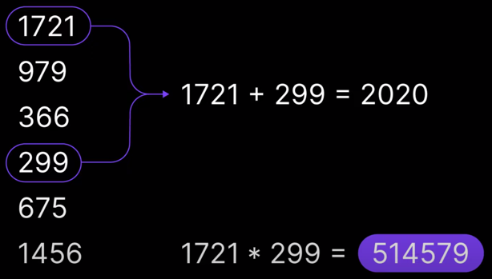
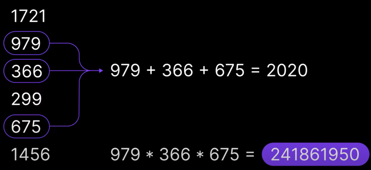

# Day 1
## [Challenge](https://adventofcode.com/2020/day/1)
In a list of numbers, we have to find the couple that sum to 2020 and  multiply them.
```text
1721
979
366
299
675
1456
```

Each line contains a `number`.

Our task is to check that the couple of numbers :
* sum to 2020
* display the result of the multiplication

> For the second part, we have to sum up three numbers.

### Part 1

Find the two numbers that sum up result to 2020, and display their multiplication.


### Part 2

Find three numbers that sum up to 2020, and display their multiplication.


### Exercise

* How would you solve it ? - 10'
    * In group, write down the pseudo algorithm (in comments for example)
* Collective debriefing - 10'
    * Let's agree on how to implement it
    * What do we need to write it in Kotlin ?
* [Step by step](src/main/kotlin/solutions/step-by-step.md) + koans - 20'
* Let's implement the solution - 20'
* Collective debriefing - 10'
    * What can be improved ?
* Go back to the [Step by step page](src/main/kotlin/solutions/step-by-step.md) on step 4 - 10'
    * Let's refactor / improve our code
* Debriefing - 5'
    * What was the most important concept you discovered today ?