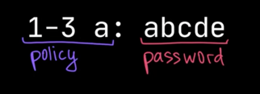
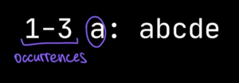

# Day 2
## [Challenge](https://adventofcode.com/2020/day/2)
We need to confirm that passwords meet the corporate policy.
```text
1-3 a: abcde
1-3 b: cdefg
2-9 c: ccccccccc
```

Each line contains the `password policy` and the `password`.  



Our task is to check that the password :
* is valid
* conforms to the given policy

> The policies are different in the first and the second parts of the challenge.

### Part 1
The password policy indicates the lowest and highest number of times a given letter must appear for the password to be
valid.  
  
For example, 1-3 a means that the password must contain `a` at least once and at most 3 times.

```text
1-3 a: abcde is valid : contains 1 `a` within the limits of the 3 occurences.
1-3 b: cdefg is invalid : no `b` within the limits.
2-9 c: ccccccccc is valid : contains 9 `c` within the limits of the 9 occurences.
```

### Part 2
In the second part, the policy describes two positions in the password :
* where 1 means the first character
* 2 means the second character, and so on...
* indexing starts at 1, not 0

> Exactly one of these positions must contain the given letter. Other occurrences of the letter are irrelevant.

Given the same example list from above:

```text
1-3 a: abcde is valid: position 1 contains a and position 3 does not.
1-3 b: cdefg is invalid: neither position 1 nor position 3 contains b.
2-9 c: ccccccccc is invalid: both positions 2 and position 9 contain c.
```

### Exercise
* How would you solve it ? - 10'
    * In group, write down the pseudo algorithm (in comments for example)
* Collective debriefing - 10`
    * Let's agree on how to implement it
    * What do we need to write it in Kotlin ?
* [Step by step](src/main/kotlin/solution/step-by-step.md) + koans - 20'
* Let's implement the solution - 20'
* Collective debriefing - 10'
    * What can be improved ?
* Go back to the [Step by step page](src/main/kotlin/solution/step-by-step.md) on step 4 - 10'
    * Let's refactor / improve our code
* Debriefing - 5'
    * What do you think about Kotlin after those 2 days ?