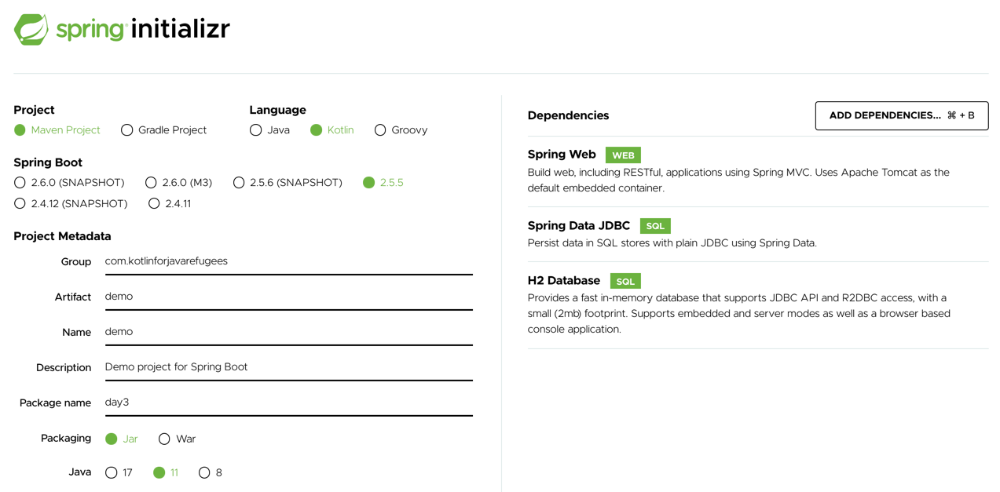
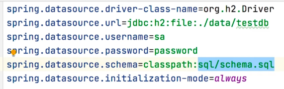

# Day 3 - Spring in Kotlin
## [Challenge](https://youtu.be/gf-kjD2ZmZk) - create a SpringBoot app
* Create a SpringBoot application from scratch
  * Use Spring Initializr
  * Add "Spring Web" / "Spring Data JDBC" / "H2 Database"
  
  
### Observe the `pom.xml`
* What is different from what you are used to ?
  ```xml
        <sourceDirectory>${project.basedir}/src/main/kotlin</sourceDirectory>
        <testSourceDirectory>${project.basedir}/src/test/kotlin</testSourceDirectory>
        <plugins>
            <plugin>
                <groupId>org.springframework.boot</groupId>
                <artifactId>spring-boot-maven-plugin</artifactId>
            </plugin>
            <plugin>
                <groupId>org.jetbrains.kotlin</groupId>
                <artifactId>kotlin-maven-plugin</artifactId>
                <configuration>
                    <args>
                        <arg>-Xjsr305=strict</arg>
                    </args>
                    <compilerPlugins>
                        <plugin>spring</plugin>
                    </compilerPlugins>
                </configuration>
                <dependencies>
                    <dependency>
                        <groupId>org.jetbrains.kotlin</groupId>
                        <artifactId>kotlin-maven-allopen</artifactId>
                        <version>${kotlin.version}</version>
                    </dependency>
                </dependencies>
            </plugin>
        </plugins>
  ```
  
### Open classes in Kotlin
* In Kotlin, all classes are final by default
  * If you compile this
    ```kotlin
    class Try
    class Success : Try()
    ```
  * The compiler will fail :
  ```kotlin
  Kotlin: This type is final, so it cannot be inherited from
  ```
  * To make a class open for extension, we should mark that class with the open keyword :
  ```kotlin
  open class Try
  class Success : Try()
  ```
> This behavior can be problematic in Spring applications : some areas in Spring only work with non-final classes.
* The natural solution is to manually open Kotlin classes using the open keyword or to use the kotlin-allopen plugin
  * Which automatically opens all classes that are necessary for Spring to work   
  
  ```xml
  <dependency>
    <groupId>org.jetbrains.kotlin</groupId>
    <artifactId>kotlin-maven-allopen</artifactId>
    <version>${kotlin.version}</version>
  </dependency>
  ```
* Know more about this plugin [here](https://www.baeldung.com/kotlin/allopen-spring)

### Analyze code structure
* How does it differ from what you are used to ?
* Open the `DemoApplication.kt` file
  * What do you notice ?
    ```kotlin
    runApplication<DemoApplication>(*args)
    ```
    
    * No worries this is not a pointer 😜
      * `*` is called the [spread operator](https://kotlinlang.org/docs/functions.html#variable-number-of-arguments-varargs)
      * Allowing us to call a function taking a vararg with an array
      * We just have to prefix the array with the operator
      
      ```kotlin
      fun <T> asList(vararg ts: T): List<T> {
          val result = ArrayList<T>()
          for (t in ts) // ts is an Array
              result.add(t)
          return result
      }
    
      val list = listOf(1, 2, 3)
      // If you want to pass a primitive type array into vararg, you need to convert it to a regular (typed) array using the toTypedArray() function:
      asList(*list.toTypedArray())
      ```

### Create a message Controller (RestController)
* Return a hardcoded list of Message on `GET`
* A message is composed by an id (String nullable) and a text

```kotlin
@RestController
class MessageController {
	@GetMapping
	fun findMessages(): List<Message> = listOf(
		Message("1", "Moi, à une époque, je voulais faire vœu de pauvreté (...) Mais avec le pognon que j'rentrais, j'arrivais pas à concilier les deux."),
		Message("2", "Au bout d'un moment, il est vraiment druide, c'mec-là, ou ça fait quinze ans qu'il me prend pour un con ?")
	)
}

data class Message(val id: String?, val text: String)
```

### Add the Database
* Create a Service that will contain 2 functions
  * `findMessages` / `addMessage`
  * Put a TODO in the addMessage function for now
  * This Service needs a Repository to retrieve the data
    * Create it
* Retrieve the Data from the Database

#### Create messages
* Add a new function in your controller to be able to create messages
  * Call your service / repository

#### Configure the database
* add an `application.properties` file


#### Add the init script
```roomsql
CREATE TABLE IF NOT EXISTS messages
(
    id   VARCHAR(60) DEFAULT RANDOM_UUID() PRIMARY KEY,
    text VARCHAR NOT NULL
);
```

### Handle null id in the message
* if the message id is null : generate one based on uuid
  * How could we implement that ?
  * Extension function can be helpful to generate a UUID based on the text input

### ToDo
* Demonstrates that we have access to KT extensions
* Add Custom Validation
  * Demonstrate that is easy to add custom annotations

Final repository available [here](https://github.com/kotlin-hands-on/spring-time-in-kotlin-episode1)

## Koans

* [The TODO() function](https://kotlinlang.org/api/latest/jvm/stdlib/kotlin/-t-o-d-o.html)
