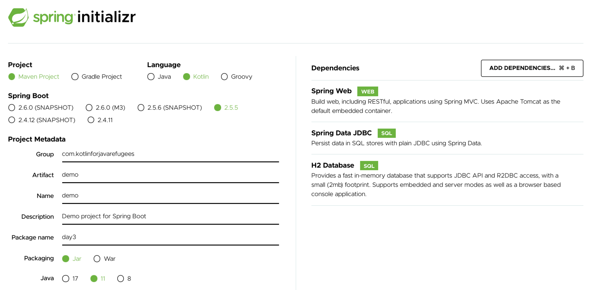

# Day 3 - Spring in Kotlin
## [Challenge](https://youtu.be/gf-kjD2ZmZk) - create a SpringBoot app
* Create a SpringBoot application from scratch
  * Use Spring Initializr
  * Add "Spring Web" / "Spring Data JDBC" / "H2 Database"
  
  
### Observe the `pom.xml`
* What is different from what you are used to ?
  ```xml
        <sourceDirectory>${project.basedir}/src/main/kotlin</sourceDirectory>
        <testSourceDirectory>${project.basedir}/src/test/kotlin</testSourceDirectory>
        <plugins>
            <plugin>
                <groupId>org.springframework.boot</groupId>
                <artifactId>spring-boot-maven-plugin</artifactId>
            </plugin>
            <plugin>
                <groupId>org.jetbrains.kotlin</groupId>
                <artifactId>kotlin-maven-plugin</artifactId>
                <configuration>
                    <args>
                        <arg>-Xjsr305=strict</arg>
                    </args>
                    <compilerPlugins>
                        <plugin>spring</plugin>
                    </compilerPlugins>
                </configuration>
                <dependencies>
                    <dependency>
                        <groupId>org.jetbrains.kotlin</groupId>
                        <artifactId>kotlin-maven-allopen</artifactId>
                        <version>${kotlin.version}</version>
                    </dependency>
                </dependencies>
            </plugin>
        </plugins>
  ```
  
### Open classes in Kotlin
* In Kotlin, all classes are final by default
  * If you compile this
    ```kotlin
    class Try
    class Success : Try()
    ```
  * The compiler will fail :
  ```kotlin
  Kotlin: This type is final, so it cannot be inherited from
  ```
  * To make a class open for extension, we should mark that class with the open keyword :
  ```kotlin
  open class Try
  class Success : Try()
  ```
> This behavior can be problematic in Spring applications : some areas in Spring only work with non-final classes.
* The natural solution is to manually open Kotlin classes using the open keyword or to use the kotlin-allopen plugin
  * Which automatically opens all classes that are necessary for Spring to work   
  
  ```xml
  <dependency>
    <groupId>org.jetbrains.kotlin</groupId>
    <artifactId>kotlin-maven-allopen</artifactId>
    <version>${kotlin.version}</version>
  </dependency>
  ```
* Know more about this plugin [here](https://www.baeldung.com/kotlin/allopen-spring)

### Analyze code structure
* How does it differ from what you are used to ?
* Open the `DemoApplication.kt` file
  * What do you notice ?
    ```kotlin
    runApplication<DemoApplication>(*args)
    ```
    
    * No worries this is not a pointer 😜
      * `*` is called the [spread operator](https://kotlinlang.org/docs/functions.html#variable-number-of-arguments-varargs)
      * Allowing us to call a function taking a vararg with an array
      * We just have to prefix the array with the operator
      
      ```kotlin
      fun <T> asList(vararg ts: T): List<T> {
          val result = ArrayList<T>()
          for (t in ts) // ts is an Array
              result.add(t)
          return result
      }
    
      val list = listOf(1, 2, 3)
      // If you want to pass a primitive type array into vararg, you need to convert it to a regular (typed) array using the toTypedArray() function:
      asList(*list.toTypedArray())
      ```

### Create a message Controller (RestController)
* Return a hardcoded list of Message on `GET`
* A message is composed by an id (String nullable) and a text

```kotlin
@RestController
class MessageController {
	@GetMapping
	fun findMessages(): List<Message> = listOf(
		Message("1", "Moi, à une époque, je voulais faire vœu de pauvreté (...) Mais avec le pognon que j'rentrais, j'arrivais pas à concilier les deux."),
		Message("2", "Au bout d'un moment, il est vraiment druide, c'mec-là, ou ça fait quinze ans qu'il me prend pour un con ?")
	)
}

data class Message(val id: String?, val text: String)
```

> Run your application and test your Rest Controller through `Postman` or `IntelliJ`

### Add the missing Layers
* Create a Service that will contain 2 functions
  * `findMessages` / `addMessage`
  * Put a TODO in the addMessage function for now
```kotlin
@Service
class MessageService {
	fun findMessages(): List<Message> {
		TODO()
	}
	fun addMessage(message: Message) {
		TODO()
	}
}
```
* What else do we need to do ?

### Add the Database / repository
* This Service needs a Repository to retrieve the data
  * Create it
```kotlin
interface MessageRepository: CrudRepository<Message, String> {
	@Query("SELECT * FROM messages")
	fun findMessages(): List<Message>
}
```
* Make our POKO representing a Table
  * Add `@Table` annotation and `@Id` on our id
```kotlin
@Table("MESSAGES")
data class Message(@Id val id: String?, val text: String)
```

### Plug everything together
* Use our repository in our Service
  * Finalize our Service implementation by saving the Message
```kotlin
@Service
class MessageService(private val repository: MessageRepository) {
	fun findMessages(): List<Message> {
		return repository.findMessages()
	}
	fun addMessage(message: Message) {
		repository.save(message)
	}
}
```
* Can be simplified by using `IntelliJ` feature :


```kotlin
@Service
class MessageService(private val repository: MessageRepository) {
	fun findMessages(): List<Message> = repository.findMessages()
	fun addMessage(message: Message) = repository.save(message)
}
```
* Use our Service in our Controller
```kotlin
    @RestController
    class MessageController(private val messageService: MessageService) {
        @GetMapping
        fun findMessages(): List<Message> = messageService.findMessages()
    }
```
* Add the mapping to be able to create new messages
```kotlin
@PostMapping
fun addMessage(@RequestBody message: Message) = messageService.addMessage(message)
```

### Configure the database
* Add an `application.properties` file
```properties
spring.datasource.driver-class-name=org.h2.Driver
spring.datasource.url=jdbc:h2:file:./data/testdb
spring.datasource.username=sa
spring.datasource.password=password
spring.datasource.schema=classpath:sql/schema.sql
spring.datasource.initialization-mode=always
```

### Add the init script
* In the `application.properties` we set the schema to `sql/schema.sql`
  * Create this file that initializes the db schema
```roomsql
CREATE TABLE IF NOT EXISTS messages
(
    id   VARCHAR(60) DEFAULT RANDOM_UUID() PRIMARY KEY,
    text VARCHAR NOT NULL
);
```

### Use our favorite mapper (MapStruct)
* In real life we would not expose our Entities directly from our Controller
  * Let's add a decoupling layer
  * Change the public contract :
    * Pass a `AddMessage` command in the POST and return a `MessageDto` in the GET
```kotlin
// Do not pass the id -> auto-generated by our db
data class AddMessage(val text: String)
// id no more nullable
data class MessageDto(val id: String, val text: String)
```
* Create our `MessageMapper` to map : 
  * AddMessage -> Message
  * Message -> MessageDto

```kotlin
@Mapper
interface MessageMapper {
	fun convertToEntity(command: AddMessage): Message
	fun convertToDto(message: Message): MessageDto
}
```

* Add mapstruct to our `pom.xml`
  * Annotation processors are supported in Kotlin with the kapt compiler plugin
  * know more about it [here](https://github.com/mapstruct/mapstruct-examples/tree/master/mapstruct-kotlin)
```xml
<mapstruct.version>1.4.2.Final</mapstruct.version>

<dependency>
    <groupId>org.mapstruct</groupId>
    <artifactId>mapstruct</artifactId>
    <version>${mapstruct.version}</version>
</dependency>

<!-- in kotlin-maven-plugin --> 
<executions>
    <execution>
        <id>kapt</id>
        <goals>
            <goal>kapt</goal>
        </goals>
        <configuration>
            <sourceDirs>
                <sourceDir>src/main/kotlin</sourceDir>
            </sourceDirs>
            <annotationProcessorPaths>
                <annotationProcessorPath>
                    <groupId>org.mapstruct</groupId>
                    <artifactId>mapstruct-processor</artifactId>
                    <version>${mapstruct.version}</version>
                </annotationProcessorPath>
            </annotationProcessorPaths>
        </configuration>
    </execution>
</executions>
```
* Use it in our `Service`

```kotlin
@Service
class MessageService(private val repository: MessageRepository) {
	private val mapper = Mappers.getMapper(MessageMapper::class.java)

	fun findMessages(): List<MessageDto> {
		return repository.findMessages()
			.map { mapper.convertToDto(it) }
	}

	fun addMessage(command: AddMessage) {
		val message = mapper.convertToEntity(command)
		repository.save(message)
	}
}
```

### Use extension functions to hide mapper
```kotlin
fun AddMessage.toEntity(): Message = Mappers.getMapper(MessageMapper::class.java).convertToEntity(this)
fun Message.toDto(): MessageDto = Mappers.getMapper(MessageMapper::class.java).convertToDto(this)
```
* Clean up our code :
```kotlin
@Service
class MessageService(private val repository: MessageRepository) {
	fun findMessages(): List<MessageDto> {
		return repository.findMessages()
			.map { it.toDto() }
	}

	fun addMessage(command: AddMessage) {
		repository.save(message.toEntity())
	}
} 
```

Final repository available [here](https://github.com/kotlin-hands-on/spring-time-in-kotlin-episode1)

## Koans
* [The TODO() function](https://kotlinlang.org/api/latest/jvm/stdlib/kotlin/-t-o-d-o.html)
