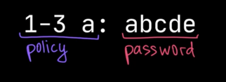
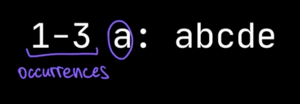

# Day 2
## [Challenge](https://adventofcode.com/2020/day/2)
We need to confirm that passwords meet the corporate policy.
```text
1-3 a: abcde
1-3 b: cdefg
2-9 c: ccccccccc
```
Each line contains the `password policy` and the `password`.

Our task is to check that the password :
* is valid
* conforms to the given policy

> The policies are different in the first and the second parts of the challenge.

### Part 1
The password policy indicates the lowest and highest number of times a given letter must appear for the password to be valid.

For example, 1-3 a means that the password must contain `a` at least once and at most 3 times.  
```text
1-3 a: abcde is valid : contains 1 `a` within the limits of the 3 occurences
1-3 b: cdefg is invalid : no `b` within the limits
2-9 c: ccccccccc is valid : contains 9 `c` within the limits of the 9 occurences
```


In this example, two passwords, the first and the third ones, are valid.


## Koans
### [Classes](https://kotlinlang.org/docs/classes.html) 
* Classes in Kotlin are declared using the keyword class:
```kotlin
class Person { /*...*/ }
```
* Can have a primary constructor and one or more secondary constructors
```kotlin
class Person constructor(firstName: String) { /*...*/ }
```
* If the primary constructor does not have any annotations or visibility modifiers, the constructor keyword can be omitted:
```kotlin
class Person(firstName: String) { /*...*/ }
```
* Kotlin has a concise syntax for declaring properties and initializing them from the primary constructor:
```kotlin
class Person(val firstName: String, val lastName: String, var isEmployed: Boolean = true)
```
Much like regular properties, properties declared in the primary constructor can be mutable (`var`) or read-only (`val`).

### [Data Classes](https://play.kotlinlang.org/koans/Classes/Data%20classes/Task.kt)
Classes whose main purpose is to hold data.  
In such classes, some standard functionality and some utility functions are often mechanically derivable from the data.  
In Kotlin, these are called data classes and are marked with data:
```kotlin
data class User(val name: String, val age: Int)
```

The compiler automatically derives the following members from all properties declared in the primary constructor:
* equals()/ hashCode() pair
* toString() of the form "User(name=John, age=42)"
* componentN() functions corresponding to the properties in their order of declaration.
* copy() function

#### Prerequisites
* The primary constructor needs to have **at least 1 parameter**.
* All primary constructor **parameters need to be marked as val or var**.
* Data classes **cannot be** abstract, open, sealed, or inner.

#### Copy()
Use the copy() function to copy an object allowing to alter some of its properties while keeping the rest unchanged
```kotlin
val jack = User(name = "Jack", age = 1)
val olderJack = jack.copy(age = 2)
```

#### Destructuring
Component functions generated for data classes make it possible to use them in destructuring declarations:
```kotlin
val jane = User("Jane", 35)
val (name, age) = jane
println("$name, $age years of age") // prints "Jane, 35 years of age"
```

#### Exercise
* Migrate this java code to a data class in Kotlin
* Instantiate 2 persons : "Neo", "Trinity"
* Use the `copy` function to create a new Person called "NeoV2" based on  
```java
public class Person {
    private final String name;
    private final int age;

    public Person(String name, int age) {
        this.name = name;
        this.age = age;
    }

    public String getName() {
        return name;
    }

    public int getAge() {
        return age;
    }
}
```

### [Companion Objects](https://kotlinlang.org/docs/object-declarations.html#companion-objects)
An object declaration inside a class can be marked with the companion keyword:
```kotlin
class MyClass {
    companion object Factory {
        fun create(): MyClass = MyClass()
    }
    
    // The name of the companion object can be omitted
    companion object { }
}
```
* A good way to define new more explicit types with enforced rules
* Makes it impossible to represent invalid states

#### Exercise
* Create a `NonZeroPositiveInteger` class with its companion
* We use the companion to create `NonZeroPositiveIntegers`
* The companion should contain 2 functions :
```kotlin
fun from(value: Int): NonZeroPositiveInteger = { ... }
fun toInt(i: NonZeroPositiveInteger): Int = { ... }
```

### [Extension functions](https://kotlinlang.org/docs/extensions.html)
Kotlin provides the ability to extend a class with new functionality without having to inherit from the class or use design patterns such as Decorator.
> For example, you can write new functions for a class from a third-party library that you can't modify

* To declare an extension function :
  * `prefix its name with a receiver type`, which refers to the type being extended
```kotlin
fun MutableList<Int>.swap(index1: Int, index2: Int) {
    val tmp = this[index1] // 'this' corresponds to the list
    this[index1] = this[index2]
    this[index2] = tmp
}
```
The `this` keyword inside an extension function corresponds to the receiver object (the one that is passed before the dot). Now, you can call such a function on any MutableList<Int>:

#### Companion object extensions
If a class has a companion object defined, you can also define extension functions and properties for the companion object. 
Just like regular members of the companion object, they can be called using only the class name as the qualifier:
```kotlin
class MyClass {
    companion object { }  // will be called "Companion"
}
fun MyClass.Companion.printCompanion() { println("companion") }

fun main() {
    MyClass.printCompanion()
}
```
### [Let : scope functions](https://kotlinlang.org/docs/scope-functions.html)
Several functions whose sole purpose is to execute a block of code within the context of an object.
When you call such a function on an object with a lambda expression provided, it forms a temporary scope. 
* In this scope, you can access the object without its name. 
* Such functions are called scope functions. 
* There are five of them: `let`, `run`, `with`, `apply`, and `also`.
```kotlin
// Without let :
val alice = Person("Alice", 20, "Amsterdam")
println(alice)
alice.moveTo("London")
alice.incrementAge()
println(alice)

// With let
Person("Alice", 20, "Amsterdam").let {
    println(it)
    it.moveTo("London")
    it.incrementAge()
    println(it)
}
````
* let scope invoked only when not null
```kotlin
val listWithNulls: List<String?> = listOf("Kotlin", null, "Clojure", null, "Scala")
for (item in listWithNulls) {
    item?.let { println(it) }
}
```

### [Higher-oder functions](https://kotlinlang.org/docs/lambdas.html#higher-order-functions)
A higher-order function is a function that takes functions as parameters, or returns a function
```kotlin
fun <T, R> Collection<T>.fold(
    initial: R,
    // accepts any function matching (R, T) -> R
    // Taking an R and a T as parameters and returning an R
    combine: (acc: R, nextElement: T) -> R
): R {
    var accumulator: R = initial
    for (element: T in this) {
        accumulator = combine(accumulator, element)
    }
    return accumulator
}
```